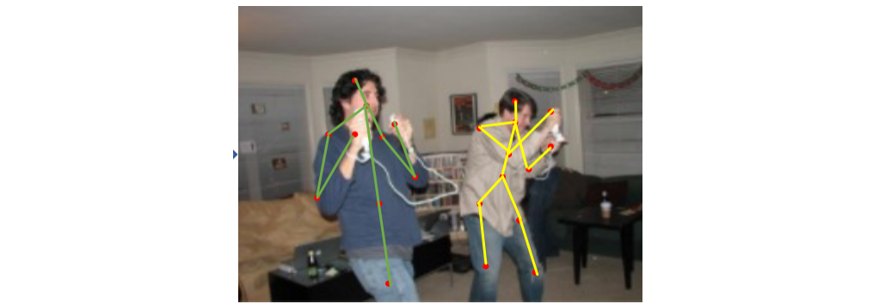
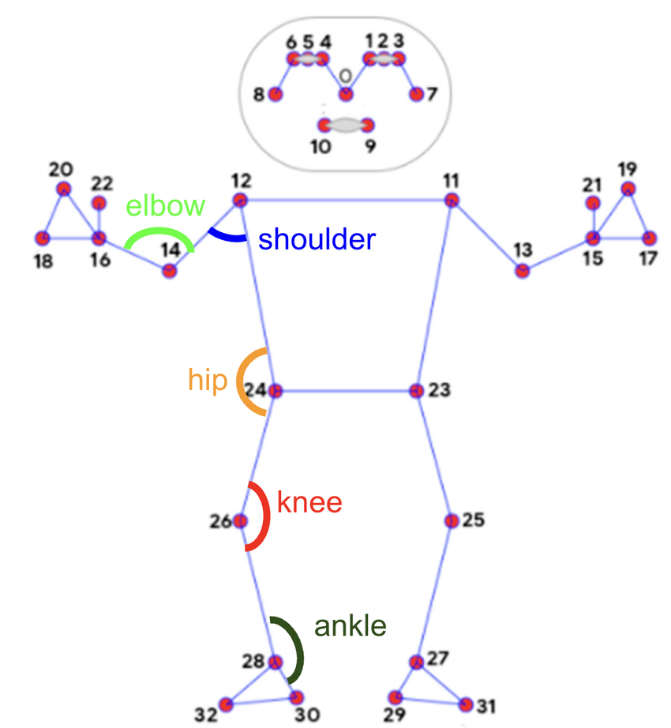

---

## 1. Core Concept (What you demonstrate to the client)

You want to show **three things happening in real time**:

1. **Pose detection** – body landmarks (shoulder, elbow, wrist, etc.) tracked live
2. **Pose interpretation** – angles and posture correctness derived from landmarks
3. **Pose logging** – frame-by-frame data saved for later analysis

This creates a very intuitive “coach watching you” experience.


---


---

## 3. Pose Detection & Landmark Tracking

Each frame gives you **33 body landmarks** (x, y, z + visibility).

Example key landmarks for weight training:

* Shoulder (left/right)
* Elbow
* Wrist
* Hip
* Knee
* Ankle

### Landmark representation (per frame)

```json
{
  "timestamp": 123456789,
  "landmarks": {
    "shoulder": { "x": 0.52, "y": 0.31 },
    "elbow": { "x": 0.60, "y": 0.45 },
    "wrist": { "x": 0.68, "y": 0.58 }
  }
}
```

 overlay:

* Skeleton lines
* Landmark dots
* Joint angles (text on screen)

This *instantly* communicates value during a call.

---


### Example: Elbow angle (bicep curl)

Given:

* Shoulder = A
* Elbow = B
* Wrist = C

Angle at elbow = angle **ABC**

#### Math (2D)

```python
import numpy as np

def calculate_angle(a, b, c):
    a, b, c = np.array(a), np.array(b), np.array(c)
    ba = a - b
    bc = c - b

    cosine_angle = np.dot(ba, bc) / (
        np.linalg.norm(ba) * np.linalg.norm(bc)
    )
    angle = np.arccos(cosine_angle)
    return np.degrees(angle)
```

### Example logic

* Curl down: ~160–180°
* Curl up: ~40–60°
* Bad form: elbow drifting forward or shoulder lifting

You can **highlight the joint in red/green** depending on correctness.

---

## 5. Real-Time Feedback (What impresses the client)

During the call, show:

* Live skeleton overlay
* Angle values updating dynamically
* Simple feedback text:

  * “Good form”
  * “Raise elbow slightly”
  * “Lock your shoulder”

This makes it obvious how a trainer could guide remotely.

Example logic:

```python
if elbow_angle < 50:
    status = "Top of curl"
elif elbow_angle > 160:
    status = "Bottom of curl"
else:
    status = "In motion"
```

---

## 6. Saving Pose Data (Pattern Tracking)

You don’t need ML for the demo—**structured logging is enough**.

### What to save

* Timestamp
* Landmark positions
* Joint angles
* Exercise state (up/down)

### Example saved row

```json
{
  "time": 2.34,
  "elbow_angle": 47.2,
  "shoulder_angle": 15.6,
  "state": "curl_up"
}
```

Later, you can show:

* Rep counts
* Angle consistency
* Fatigue patterns

This sets up future upsells (analytics, coaching).

---

##  How to Demo This Over a Video Call

### Best approach

1. Run the prototype locally
2. Share your screen on Zoom / Meet
3. Perform a simple exercise (curl, squat)

   * “These dots are joints”
   * “This angle tells us elbow flexion”
   * “This data is being stored for later review”

Optional:

* Ask the client to try it on *their* webcam
* Switch input source live

---


---

## Summary

* **Use Python + MediaPipe + OpenCV** for the prototype
* **Do NOT try to tap into a video-call app’s stream** (Zoom/Meet/etc.)
* **Use the webcam directly** and *share your screen* during the call
* **WebRTC is the next step**, not needed for demo 1

* **Android can run MediaPipe fully on-device** (no server required)

 Absolutely feasible on **lightweight hardware**, both now and later.

---

##  Bare-arm tracking scope 

You only need:

* Hip (optional anchor)
* Shoulder
* Elbow
* Wrist
  (+ fingertips optional)

MediaPipe Pose already gives you:

* Shoulder ✔
* Elbow ✔
* Wrist ✔
* Hip ✔

So you **do not need hand tracking** for this demo. Pose alone is enough and more stable for curls.

### Curl logic (single-view assumption)

* Shoulder–Elbow–Wrist angle → curl up/down
* Shoulder–Hip alignment → cheating detection
* Elbow drift → bad form flag

This is *exactly* what MediaPipe Pose excels at.

---

## Can you take the video stream from a video-calling app?

### Not a good idea

**Reasons:**

1. Video-call apps **do not expose raw frames**
2. Streams are encrypted
3. OS-level screen capture introduces:

   * Latency
   * Compression artifacts
   * Frame drops
4. Legal/privacy gray area

Even if technically possible, it’s **fragile and unnecessary**.

---

##  The cleanest demo architecture (recommended)






### Setup

* Your laptop runs:

  * Webcam → OpenCV
  * MediaPipe Pose
  * Angle logic
  * On-screen overlay
* You **screen-share this window** on the video call

### Why this is ideal

* Zero networking complexity
* Full control of frames
* Deterministic performance
* Easy to explain to client
* Exactly the same pipeline as future apps

You can even:

* Switch webcam input to **their camera** if they run it locally
* Or guide them verbally while you demonstrate

---

##  Python vs C++ 
###  C++ (for now)

Only worth it if:

* You need embedded hardware optimization

### ✅ Python (what you should use)

* MediaPipe Python API is **fast enough**
* Pose runs ~25–30 FPS on CPU
* Your bottleneck will be **camera**, not inference
* Much faster iteration

> For a curl demo, Python performance is more than sufficient.


---

## MediaPipe performance concerns (CPU / TensorFlow)

Important clarification:

### MediaPipe ≠ “TensorFlow running live”

MediaPipe uses:

* Optimized TFLite models
* Graph-based execution
* SIMD acceleration
* CPU by default, GPU where available

On a modern laptop CPU:

* Pose runs comfortably
* No discrete GPU required
* Hand + pose together still workable

You’ve already seen this with hand tracking — pose is similar.

---

## WebRTC — when does it make sense?

 just **one step early**.

### When WebRTC *is* useful

* Remote client video input
* Browser-based demo
* No local installation
* Trainer and trainee in different locations

### But for now…

* It adds signaling
* NAT traversal
* Browser constraints
* Debug complexity

**Do this later**, once:

* Client says “Yes, we want remote coaching”
* You’ve validated pose logic

---

## 7. Android future: on-device vs server-side

This is an important strategic question — .

### MediaPipe on Android

✅ Fully **on-device**

* Uses:

  * CPU
  * GPU (OpenGL / Vulkan)
  * NNAPI (when available)
* No internet required
* Low latency
* Privacy-friendly

### When server-side makes sense

* Multi-person analysis
* Heavy analytics
* Historical comparison across users
* Model retraining

### Likely architecture later

```
Device:
- Live pose
- Angle feedback
- Rep counting

Server:
- Session summaries
- Trend analysis
- Coach dashboards
```

For fitness coaching, **on-device is the right default**.


* Build your *own* video pipeline (WebRTC)


---

## Phases

### Phase 1 – Local demo 

* Webcam input
* MediaPipe Pose
* Shoulder–Elbow–Wrist angle
* Curl up / down text
* Skeleton overlay
* Screen-share during call

### Phase 2

* Color-coded joints
* Rep counter
* Bad-form warnings
* CSV / JSON logging

### Phase 3 – Remote input 

* WebRTC browser client
* Same pose logic
* Same angle math

---

