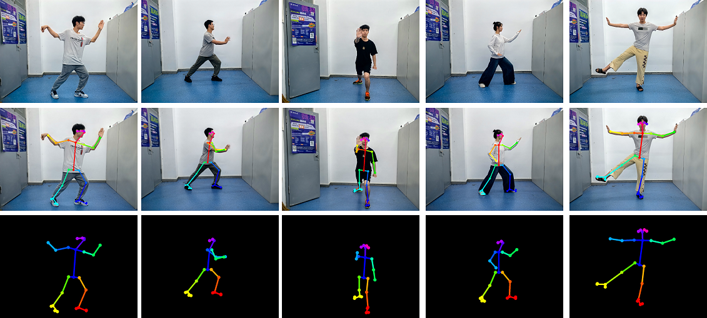
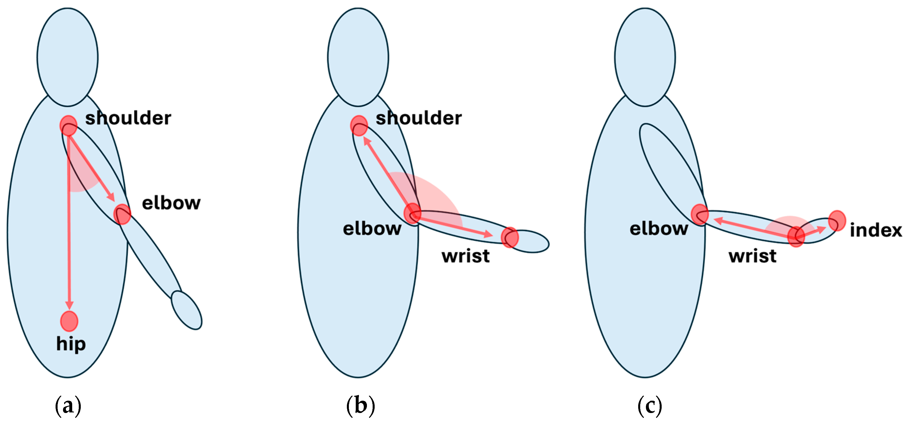

---

## 1. Core Concept (What you demonstrate to the client)

You want to show **three things happening in real time**:

1. **Pose detection** – body landmarks (shoulder, elbow, wrist, etc.) tracked live
2. **Pose interpretation** – angles and posture correctness derived from landmarks
3. **Pose logging** – frame-by-frame data saved for later analysis

This creates a very intuitive “coach watching you” experience.






---


---

## 3. Pose Detection & Landmark Tracking

Each frame gives you **33 body landmarks** (x, y, z + visibility).

Example key landmarks for weight training:

* Shoulder (left/right)
* Elbow
* Wrist
* Hip
* Knee
* Ankle

### Landmark representation (per frame)

```json
{
  "timestamp": 123456789,
  "landmarks": {
    "shoulder": { "x": 0.52, "y": 0.31 },
    "elbow": { "x": 0.60, "y": 0.45 },
    "wrist": { "x": 0.68, "y": 0.58 }
  }
}
```

 overlay:

* Skeleton lines
* Landmark dots
* Joint angles (text on screen)

This *instantly* communicates value during a call.

---


### Example: Elbow angle (bicep curl)

Given:

* Shoulder = A
* Elbow = B
* Wrist = C

Angle at elbow = angle **ABC**

#### Math (2D)

```python
import numpy as np

def calculate_angle(a, b, c):
    a, b, c = np.array(a), np.array(b), np.array(c)
    ba = a - b
    bc = c - b

    cosine_angle = np.dot(ba, bc) / (
        np.linalg.norm(ba) * np.linalg.norm(bc)
    )
    angle = np.arccos(cosine_angle)
    return np.degrees(angle)
```

### Example logic

* Curl down: ~160–180°
* Curl up: ~40–60°
* Bad form: elbow drifting forward or shoulder lifting

You can **highlight the joint in red/green** depending on correctness.

---

## 5. Real-Time Feedback (What impresses the client)

During the call, show:

* Live skeleton overlay
* Angle values updating dynamically
* Simple feedback text:

  * “Good form”
  * “Raise elbow slightly”
  * “Lock your shoulder”

This makes it obvious how a trainer could guide remotely.

Example logic:

```python
if elbow_angle < 50:
    status = "Top of curl"
elif elbow_angle > 160:
    status = "Bottom of curl"
else:
    status = "In motion"
```

---

## 6. Saving Pose Data (Pattern Tracking)

You don’t need ML for the demo—**structured logging is enough**.

### What to save

* Timestamp
* Landmark positions
* Joint angles
* Exercise state (up/down)

### Example saved row

```json
{
  "time": 2.34,
  "elbow_angle": 47.2,
  "shoulder_angle": 15.6,
  "state": "curl_up"
}
```

Later, you can show:

* Rep counts
* Angle consistency
* Fatigue patterns

This sets up future upsells (analytics, coaching, ML).

---

##  How to Demo This Over a Video Call

### Best approach

1. Run the prototype locally
2. Share your screen on Zoom / Meet
3. Perform a simple exercise (curl, squat)
4. Narrate what’s happening:

   * “These dots are joints”
   * “This angle tells us elbow flexion”
   * “This data is being stored for later review”

Optional:

* Ask the client to try it on *their* webcam
* Switch input source live

---


